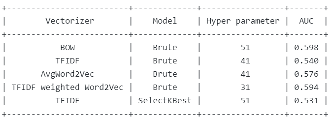
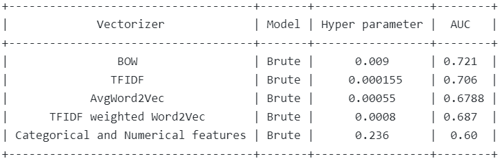
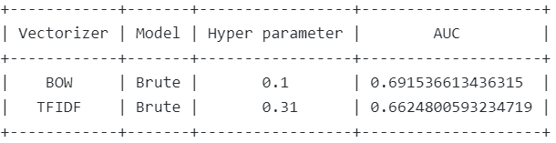

# DonorsChoose.org Application Screening
## *Can you predict whether teachers' project proposals are accepted?*

  

## Task 

Donorschoose.org receives project proposals from thousands of teachers who need funding for their classroom projects. The Donorchoose.org volunteers need to manually evaluate all the received proposals to decide whether to approve the project or not. However, such a process is not scalable especially when Donorschoose.org expects to receive over 500,000 applications next year. 

The goal of the project is to predict whether or not a DonorsChoose.org project proposal submitted by a teacher will be approved, using the text of project descriptions as well as additional metadata about the project, teacher, and school. DonorsChoose.org can then use this information to identify projects most likely to need further review before approval. 

## Evaluation 

The models were evaluated using the Area Under the Receiver Operating Characteristic curve (AU-ROC or AUC).

## Approach

Datasource: https://www.kaggle.com/c/donorschoose-application-screening/data

Features from text: 
1) Bag of words
2) TF-IDF 
3) Glove vectors 

Models Built:
1) KNN

  

2) Logistic Regression 

  

3) Naive Bayes

  

## Results 

